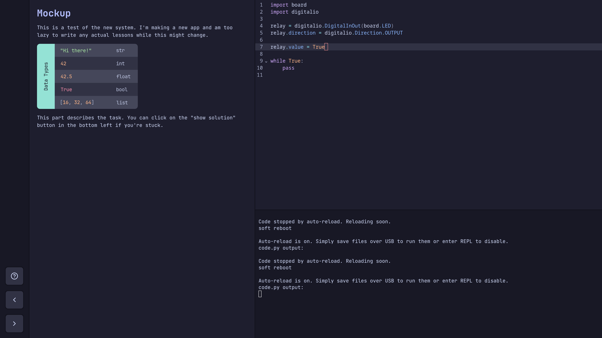

---
tags:
- resource
area: "[[lab]]"
publish: "[[blog]]"
created: 2025-06-29
updated: 2025-06-29
---

Hello, world! The rewrite is done! Here's what the app looks like now:

## Features
- save files to the board / read from it
- automatically connect to the board
- read lessons from the main website
- connect to the REPL
- show solution

## TODOs
- add a mode without the editor on the right
- implement (natural) language switching
- write the set-up guide
- start writing projects

After that part is done, I'll add a GitHub workflow for building the app and merge it into master.

I'll try to have that done by the end of the week. See you on 2025-07-06!