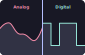

Note: in this font, `0O Il1` all look different.

We'll modify the last exercise to control the LED now. Type `gg` to go to the beginning of the file. Press `o` to create a new line below the current one. Import the `digitalio` module.

The `digitalio` module is used to read and control pins as *digital* inputs or outputs. There are 2 kinds of signals: digital and analog.



Analog signals vary between 0 volts and some maximum, 3.3V in this case. Digital is either on or off.

To work with a digital input / output you first have to create it. Press ESC to return to command mode, then `G` to go to the end of the file. Press `cc` to replace (`change`) the line. Type `lamp = digitalio.DigitalInOut(board.LED)`:
- `lamp` is a variable. Think of it like a box in MCU's memory where we can put something. In this case, we put in out Digital In / Out.
- `digitalio.DigitalInOut` is a constructor of a class (don't worry about what that means, but a constructor is a function) in the `digitalio` module. It allows us to interact with the inputs / outputs.
- `board.LED` is the argument we pass into the constructor.

Press enter and type `led.direction = digitalio.Direction.OUTPUT`:
- `led.direction` is a field inside the class. It's the same thing as a variable, but it's inside a class.
- `digitalio.Direction.OUTPUT` is one of the two possible values for that field, the other is `digitalio.Direction.INPUT`. `OUTPUT` tells the MCU that it can apply voltage to that pin without the risk of burning anything. `INPUT` only allows reading the voltage.

Press enter and add `print(led.value)`, then press ESC and save the file using `:w`.

The board should print out `False` and then `Code done running.`.

Press `gg`, then `O` to insert a line before the beginning of the file. Import `time`. Return to normal mode using ESC and go to the end of the file using `G`. Insert a new line below with `o`, type `led.value = True`, press enter and type `time.sleep(1)`. Return to normal mode and save the file.

Depending on your exact microcontroller board, the LED on it may or may not turn on for a second. If it hasn't, press `k` to go up, then `cw` to replace the next word (`change word`). Type `False`, return to normal mode and save the file.

Now you can turn on the LED on the microcontroller board.

---

```python
import time
import board
import digitalio

led = digitalio.DigitalInOut(board.LED)
led.direction = digitalio.Direction.OUTPUT
print(led.value)
led.value = False
time.sleep(1)
```