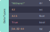

---
tags:
- resource
style: lab
area: "[[lab]]"
publish: "[[lab-src]]"
lang: en
runner: lab-circuitpy-runner
next: "[[lab-welcome]]"
---

This is a test of the new system. I'm making a new app and am too lazy to write any actual lessons while this might change.



This part describes the task. You can click on the "show solution" button in the bottom left if you're stuck.

---

```python
print("This is the solution")
```