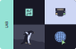

This is a work-in-progress course for beginners that goes over:
- electronics / programming microcontrollers
- exchanging data over the network
- Linux basics
- websites & webapps

It is composed of small-ish projects. You'll need to get some hardware for some of them. All of it can be re-used later.

Press "next" in the bottom left to continue.
